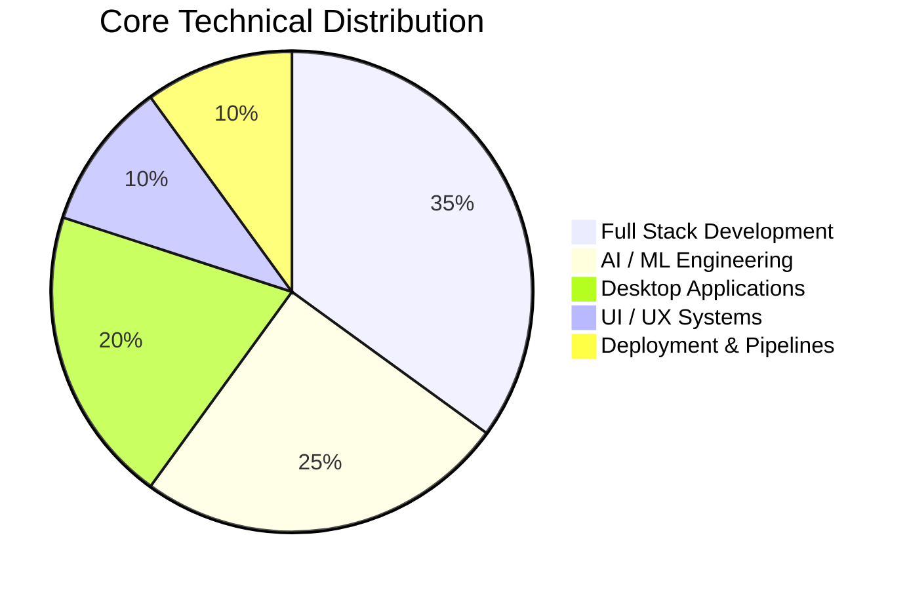
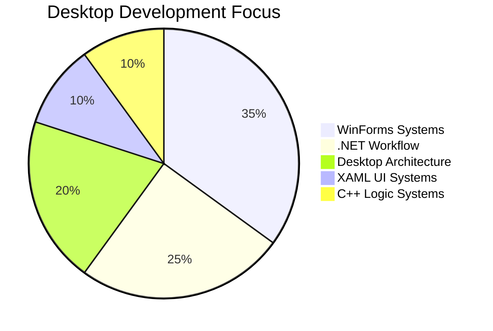
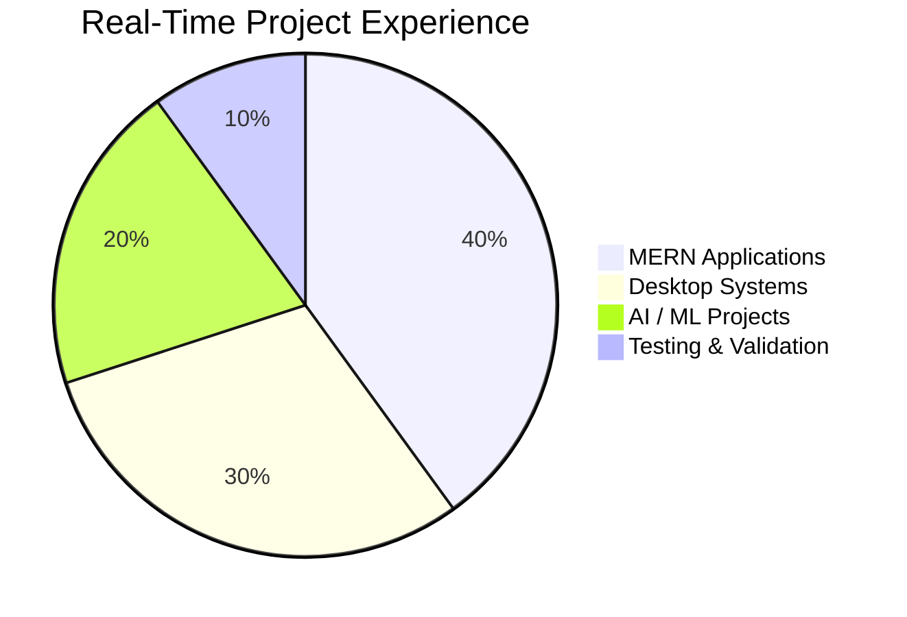

# 👋 Hey, I'm Sabari Sekaran

```text
AI & Full Stack Developer
Workflow Architect
Desktop Application Builder
Real-Time System Explorer
UI / UX Enthusiast
AI Workflow Engineer
```

🎓 B.Tech Artificial Intelligence & Data Science Student  
💡 Focused on building scalable AI systems, workflow-based platforms, desktop applications, and real-time full-stack architectures.

---

# 🚀 Developer Analytics Dashboard

## 🧠 Core Skill Distribution



---

# 📈 Technical Growth Timeline

```text
2024 ─────────────────────────────────────────────── 2026

Python & Java Basics
████████████████████████████████████████████ 100%

Frontend Development
      ██████████████████████████████████████ 90%

AI / ML Workflow
            ██████████████████████████████ 80%

Desktop Development
                  ████████████████████████ 80%

Workflow Architecture
                        ██████████████████ 75%

Cloud & Deployment
                             ████████████ 60%
```

---

# ⚡ Technical Performance Metrics

## 🌐 Full Stack Engineering

```text
React.js Development         ██████████ 90%
Backend API Development      ████████░░ 80%
MERN Architecture            ████████░░ 80%
Authentication Systems       ███████░░░ 75%
REST API Integration         ████████░░ 80%
Responsive UI Systems        █████████░ 85%
Deployment Workflow          ███████░░░ 70%
```

### 💡 Full Stack Workflow

```text
Frontend Structuring
        ↓
Backend API Integration
        ↓
Database Connectivity
        ↓
Authentication Workflow
        ↓
Deployment Pipeline
```

---

## 🤖 AI / ML Engineering

```text
Machine Learning             ████████░░ 80%
Computer Vision              ███████░░░ 75%
NLP Workflow                 ███████░░░ 70%
Transformer Models           ██████░░░░ 60%
Deep Learning Pipelines      ███████░░░ 70%
AI Integration Workflow      ███████░░░ 75%
```

### ⚡ AI Workflow Architecture

```text
Image Processing
      ↓
Feature Extraction
      ↓
Transformer Workflow
      ↓
NLP Processing
      ↓
AI Output Generation
```

---

## 🖥️ Desktop Development Analytics



---

## ☁️ Deployment & Pipeline Systems

```text
Git & GitHub Workflow        ████████░░ 80%
Docker Workflow              ██████░░░░ 60%
AWS Basics                   ██████░░░░ 60%
Pipeline Structuring         ███████░░░ 70%
Deployment Architecture      ███████░░░ 70%
Workflow Automation          ███████░░░ 75%
```

---

# 🌟 Real-Time Project Experience



---

# 📈 Real-Time Project Timeline

```text
2024
│
├── Expense Tracker
│      ████████░░░░░░░░░░ 40%
│
├── Image Captioning AI
│      ██████████████░░░░ 75%
│
└── Frontend Workflow Learning
       █████████████████░ 85%

2025
│
├── Leaf Disease Detection ML
│      ███████████████░░░ 80%
│
├── Billing Management Software
│      ████████████████░░ 85%
│
├── Truf Zone Web Application
│      ███████████████░░░ 80%
│
├── Vehicle Management Platform
│      ███████████████░░░ 80%
│
├── Railax Desktop App
│      █████████████░░░░░ 70%
│
└── Luggage Management System
       ███████████░░░░░░░ 60%

2026
│
├── ParkEase Workflow
│      █████████████░░░░░ 70%
│
├── Railax Optimization
│      ████████████░░░░░░ 65%
│
└── PLANORA + AI Integration
       ███████████████░░░ 80%
```

---

# 🧾 Billing Management Software — Mar 2025

## 📌 Real-Time Scenario

Started exploring business-oriented desktop workflow systems using WinForms and .NET technologies.

### ⚡ Workflow Structure

```text
Customer Entry
      ↓
Invoice Generation
      ↓
Billing Workflow
      ↓
Desktop Processing
      ↓
Data Management
```

### 💡 Key Contributions

```text
✔ Invoice Workflow Logic
✔ Customer Data Handling
✔ Event-Driven Architecture
✔ Desktop UI Structuring
✔ Workflow-Based Navigation
```

### 🎯 What I Learned

```text
Desktop Workflow Architecture
        ↓
Business Logic Structuring
        ↓
Event Handling Systems
        ↓
Desktop Application Planning
```

---

# 🌐 Truf Zone Web Application — Apr 2025

## 📌 Real-Time Scenario

Worked on responsive frontend systems and scalable workflow-oriented web architecture.

### ⚡ Frontend Workflow

```text
Responsive Layout
      ↓
Workflow Structuring
      ↓
Frontend Optimization
      ↓
Scalable UI Planning
```

### 💡 Worked Areas

```text
✔ Responsive UI Systems
✔ Frontend Architecture
✔ Workflow-Based Structuring
✔ Optimization Workflow
```

---

# 🚘 Vehicle Management Platform — May-Jun 2025

## 📌 Real-Time Scenario

Developed a workflow-based management platform focused on operational tracking and dashboard systems.

### ⚡ System Architecture

```text
Vehicle Entry
      ↓
Operational Workflow
      ↓
Dashboard Management
      ↓
Data Tracking
      ↓
Monitoring System
```

### 💡 Key Features

```text
✔ Vehicle Workflow Tracking
✔ Dashboard Systems
✔ Operational Management
✔ Frontend-Backend Connectivity
```

### 🎯 Project Takeaway

```text
Real-Time Workflow Handling
        ↓
Management Architecture
        ↓
Operational System Structuring
```

---

# 🚆 Railax Desktop Application — Aug 2025

## 📌 Real-Time Scenario

Built structured desktop workflows focused on operational management and scalable desktop architecture.

### ⚡ Desktop Architecture

```text
Desktop Navigation
        ↓
Workflow Processing
        ↓
Operational Handling
        ↓
System Management
```

### 💡 Current Optimizations — Mar 2026

```text
UI Optimization
      ↓
Workflow Improvements
      ↓
Feature Enhancements
      ↓
System Expansion
```

### 🎯 Learned

```text
Desktop System Scaling
        ↓
Workflow Optimization
        ↓
Architecture Enhancement
```

---

# 📦 Luggage Management System — Dec 2025

## 📌 Real-Time Scenario

Building a workflow-driven luggage tracking and management desktop application.

### ⚡ Workflow Pipeline

```text
Luggage Entry
      ↓
Tracking Workflow
      ↓
Operational Handling
      ↓
Status Monitoring
      ↓
Data Management
```

### 💡 Current Focus

```text
✔ Tracking Systems
✔ Workflow Optimization
✔ Desktop Management
✔ Operational Architecture
```

---

# 📱 ParkEase — Jan 2026

## 📌 Real-Time Scenario

Worked in development and testing workflow of a React Native application.

### ⚡ Testing Pipeline

```text
Feature Development
       ↓
UI Validation
       ↓
Bug Tracking
       ↓
Testing Workflow
       ↓
System Monitoring
```

### 💡 Contributions

```text
✔ Workflow Testing
✔ Feature Validation
✔ UI Handling
✔ System Monitoring
✔ Development Support
```

---

# 🚀 PLANORA — Ongoing Project

## 📌 Real-Time Scenario

Developing a scalable MERN-based event workflow platform integrating QR systems, dashboard analytics, workflow automation, and AI-driven assistance.

---

## ⚡ PLANORA Core Workflow

```text
Authentication
      ↓
Event Creation
      ↓
Coordinator Workflow
      ↓
Registration System
      ↓
QR Verification
      ↓
Dashboard Analytics
      ↓
Reports & Monitoring
```

---

## 🤖 AI Workflow Integration

```text
User Query
      ↓
AI Chat Integration
      ↓
Workflow Assistance
      ↓
Automation Pipeline
      ↓
Smart System Response
```

---

## 📊 PLANORA Development Status

```text
Frontend Architecture       █████████░ 85%
Backend Workflow            ████████░░ 80%
QR Verification System      ████████░░ 80%
Dashboard Analytics         ███████░░░ 75%
AI Chat Integration         ██████░░░░ 60%
Automation Pipeline         ██████░░░░ 60%
Deployment Workflow         ███████░░░ 70%
```

---

# 🧠 AI Journey

# 🖼️ Image Captioning AI — Aug 2024

### ⚡ AI Workflow

```text
Image Upload
      ↓
Feature Extraction
      ↓
Transformer Processing
      ↓
Caption Generation
      ↓
AI Output
```

### 💡 Learned

```text
✔ NLP Fundamentals
✔ Transformer Models
✔ AI Inference Pipelines
✔ Computer Vision Workflow
```

---

# 🌿 Leaf Disease Detection ML — Jan 2025

### ⚡ Workflow Architecture

```text
Leaf Image
      ↓
Image Processing
      ↓
Disease Detection
      ↓
Caption Generation
      ↓
AI Output
```

### 💡 Learned

```text
✔ Deep Learning Pipelines
✔ AI Workflow Integration
✔ Computer Vision Systems
✔ Real-World AI Structuring
```

---

# 📊 Overall Technical Analytics

```text
Real-Time Projects           ████████░░ 80%
AI Workflow Systems          ███████░░░ 75%
Full Stack Architecture      ████████░░ 80%
Desktop System Engineering   ████████░░ 80%
UI / UX Structuring          █████████░ 85%
Workflow Planning            ████████░░ 80%
Testing & Validation         ███████░░░ 75%
System Optimization          ███████░░░ 75%
```

---

# 📈 Current Learning & Exploration

```text
🟢 AI Automation Systems
🟢 AWS & Cloud Services
🟢 Matplotlib & Data Science
🟢 Scalable System Design
🟢 Workflow Automation Pipelines
🟢 Real-Time AI Integration
🟢 Smart Dashboard Systems
```

---

# 📊 GitHub Analytics


---

# 🎯 Career Goal

```text
Build Intelligent Software Systems
            ↓
Create Scalable AI Architectures
            ↓
Develop Workflow-Driven Platforms
            ↓
Solve Real-World Operational Problems
```

---

# 📫 Connect With Me

🔗 GitHub  
https://github.com/Sabarisekaran

🔗 LinkedIn  
https://www.linkedin.com/in/sabari-sekaran-mu-9238032a3/
