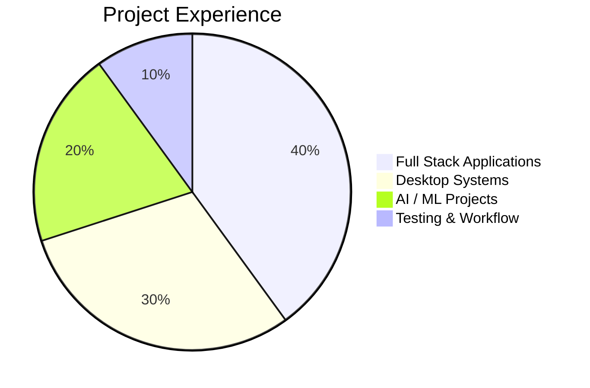

# 👋 Hey, I'm Sabari Sekaran

```text
AI & Full Stack Developer
Workflow Architect
Desktop Application Builder
Real-Time System Explorer
UI / UX Enthusiast
```

🎓 B.Tech Artificial Intelligence & Data Science Student  
💡 Building scalable AI systems, desktop applications, workflow-driven platforms, and modern full-stack architectures.

---

# 🌐 Portfolio Website

```text
Portfolio Link:
https://your-portfolio-link.vercel.app
```

> Replace the above link with your deployed portfolio website later.

---

# 📄 Resume Repository

```text
Resume GitHub Repo:
https://github.com/Sabarisekaran/my_resume
```

> This repository contains my professional resume portfolio and related project files.

# ⚡ Tech Stack

<p align="center">
  
</p>

---

# 📊 GitHub Analytics


---

# 🚀 Developer Journey

```text
2024
│
├── Started Python, Java & Frontend Learning
├── Built Expense Tracker Application
├── Entered AI using Image Captioning
└── Explored Frontend Workflow Systems

2025
│
├── Leaf Disease Detection ML
├── Billing Management Desktop Software
├── Truf Zone Web Application
├── Vehicle Management Platform
├── Railax Desktop Application
└── Luggage Management System

2026
│
├── ParkEase Workflow & Testing
├── Railax Optimization
└── PLANORA + AI Integration
```

---

# 📈 Technical Performance

## 🌐 Full Stack Engineering

```text
Frontend Development         ██████████ 90%
Backend API Workflow         ████████░░ 80%
MERN Architecture            ████████░░ 80%
Responsive UI Systems        █████████░ 85%
Authentication Workflow      ███████░░░ 75%
Deployment Pipelines         ███████░░░ 70%
```

---

## 🤖 AI / ML Engineering

```text
Machine Learning             ████████░░ 80%
Computer Vision              ███████░░░ 75%
NLP Workflow                 ███████░░░ 70%
Deep Learning Pipelines      ███████░░░ 70%
Transformer Integration      ██████░░░░ 60%
AI Workflow Systems          ███████░░░ 75%
```

---

## 🖥️ Desktop Development

```text
WinForms Systems             ████████░░ 80%
Desktop Workflow Design      ████████░░ 80%
.NET Framework               ███████░░░ 70%
XAML UI Structuring          ██████░░░░ 60%
C++ Logic Systems            ███████░░░ 70%
```

---

# 🌟 Featured Real-Time Projects

## 🚀 PLANORA — Ongoing

Scalable MERN-based event workflow management platform integrating:
- QR Verification Systems
- Dashboard Analytics
- Coordinator Workflow
- Registration Handling
- AI Chat Integration
- Workflow Automation

### ⚡ Workflow

```text
Authentication
      ↓
Event Management
      ↓
Registration Workflow
      ↓
QR Verification
      ↓
Dashboard Analytics
      ↓
AI Automation
```

### 🛠️ Stack
React.js • Node.js • MongoDB • Tailwind CSS

---

## 🚆 Railax Desktop Application

Desktop workflow system focused on operational handling and scalable desktop architecture.

### Current Improvements
```text
UI Optimization
      ↓
Workflow Enhancements
      ↓
Feature Expansion
      ↓
System Scaling
```

### 🛠️ Stack
WinForms • XAML • .NET

---

## 🧾 Billing Management Software

Business-oriented desktop application developed for billing workflow and customer management systems.

### ⚡ Workflow

```text
Customer Entry
      ↓
Invoice Generation
      ↓
Billing Workflow
      ↓
Desktop Processing
```

### 🛠️ Stack
WinForms • .NET • Visual Studio

---

## 🚘 Vehicle Management Platform

Workflow-driven management platform for operational tracking and dashboard systems.

### ⚡ Workflow

```text
Vehicle Entry
      ↓
Operational Tracking
      ↓
Dashboard Workflow
      ↓
Monitoring System
```

### 🛠️ Stack
React.js • Node.js • MongoDB

---

## 🤖 AI Image Captioning System

AI-powered image captioning platform using NLP and transformer-based workflows.

### ⚡ AI Workflow

```text
Image Upload
      ↓
Feature Extraction
      ↓
Transformer Processing
      ↓
Caption Generation
      ↓
AI Output
```

### 🛠️ Stack
Python • Flask • Transformers • PyTorch

---

# 📊 Project Experience Distribution



---

# 📚 Currently Exploring

```text
🟢 AI Automation Systems
🟢 Cloud & AWS Workflows
🟢 Data Science Visualization
🟢 Deployment Pipelines
🟢 Scalable System Architecture
🟢 Real-Time AI Integration
```

---

# 🎯 Career Goal

```text
Build Intelligent Systems
          ↓
Create Scalable Architectures
          ↓
Develop Workflow-Driven Platforms
          ↓
Solve Real-World Problems using AI
```

---

# 📫 Connect With Me

🔗 GitHub  
https://github.com/Sabarisekaran

🔗 LinkedIn  
https://www.linkedin.com/in/sabari-sekaran-mu-9238032a3/
